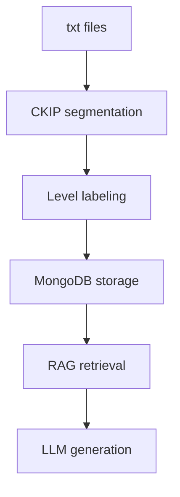

# Project Title

Personalized Mandarin Reading Learning Assistant 情勒橘子


## Project Description

“Personalized Mandarin Reading Learning Assistant” is a Generative AI system powered by a Large Language Model (LLM) that can adapt Mandarin reading to meet users’ Mandarin proficiency level. With China’s rise in the twenty-first century, global demand for Chinese as a second language proficiency has surged (Tsai & Chang, 2025). As international students come to study in Taiwan, they aim to improve their Mandarin by taking TOCFL. In response to this initiative, the development of learning materials and assisting tools has become increasingly crucial. However, when reading material exceeds the reader's proficiency level or the reader does not have sufficient background knowledge about the material, more readable written material is likely to produce better learning outcomes than less readable material (Klare, 2000). Currently, there’s no widely adopted system that can adapt Mandarin reading to meet users’ Mandarin proficiency level, which shows a need for a personalized reading support system to help learners achieve better reading comprehension.

We manually collected 115 Mandarin reading texts as training data and combined graded vocabulary resources, CKIP Transformers, MongoDB, and Retrieval-Augmented Generation (RAG) techniques to construct the system. Based on our RAG, carefully designed prompts, and learners’ Mandarin proficiency levels, LLM rewrites user-uploaded texts and generates Mandarin reading material which is suitable for users. Evaluation mechanisms were developed to assess whether the generated content matches the target proficiency level and preserves the original meaning. However, the system is still limited by the size of the dataset and potential bias in training data selection. This project demonstrates how Generative AI can support personalized language learning by providing accessible reading materials to enhance Mandarin learners’ engagement in Mandarin reading.

## Getting Started

The codes for now can only run on Google Colab, you will need secrets of OpenAI's api key'OPENAI_API_KEY' and MongoDB URL 'MGDB_IAI'. 
Codes that can run on local devices are still under development.

To see the user interface and result, download and run `0525LLM(Peggy).ipynb` on Colab.

## File Structure

```text
Intro-to-AI-g8/
│
├── README.md
│
├── colab codes/
│   ├── 0502測試.py
│   ├── 0511CKIP(Joanne).ipynb
│   ├── 0519詩CKIP(Joanne).ipynb
│   ├── 0522詞語分級_新的演算法(Peggy).ipynb
│   ├── Group8_期末專題RAG.ipynb
│   └── 0525LLM(Peggy).ipynb
│
├── csv/
│   ├── labeled_training_data_文本.csv
│   ├── labeled_training_data_詩集.csv
│   ├── processed_segments_with_ckip_文本.csv
│   ├── processed_segments_with_ckip_詩集.csv
│   └── 漢字與詞語.csv
│
└── txt_datas/
    ├── poems/
    └── texts/
```

#### Explanation

+ colab codes/
    * 0502測試.py
	    * This colab file is for context loading and initial segmentation.
    * 0511CKIP(Joanne).ipynb
	    * This colab file is for further context tokenization, which was used in processing both our training data and user's input.
    * 0519詩CKIP(Joanne).ipynb
	    * This colab file is specifically for poem tokenization.
    * 0522詞語分級_新的演算法(Peggy).ipynb
	    * This colab file is to label the processed training data with the levels provided by National Academy for Educational Research. 
    * Group8_期末專題RAG.ipynb
	    * This colab file is to upload trained data and rubric data on MongoDB to construct our RAG for futher LLM training. 
    * 0525LLM(Peggy).ipynb
	    * This colab file is to train our LLM to rewrite text based on RAG. Afterward, we design an interactive quiz and an accuracy indicator demonstrating via Gradio interface.

+ csv/
    * labeled_training_data_文本.csv
	    * This file includes 272 segmented texts which have been labeled to level 1 to level 7, based on leveling rules designed by us.
      * The leveling formula is shown below:
        <p align="center">
          
        </p>
	    * eg. There are 10 valid word counts within a sentence. If 8 of them are in level 1, 1 of them is in level 2, and 1 of them is in level 3, the total score will be calculated as: (8×1)+(1×2)+(1×3)=13. The average score of the sentence would be calculated as the total score divided by valid word counts, which is 13/10​=1.3. The final level for the sentence would be rounded into level 1 from 1.3.
    * labeled_training_data_詩集.csv
	    * This file includes 50 segmented poems which have been labeled to level 1 to level 7, based on leveling rules explained above.
    * processed_segments_with_ckip_文本.csv
	    * This file shows the source and length for each processed Mandarin text segment, and outputs after undergone word segmentation (WS) and part-of-speech tagging (POS) model.
    * processed_segments_with_ckip_詩集.csv
	    * This file shows the source and length for each processed Mandarin poem segment, and outputs after undergone WS and POS model.
    * 漢字與詞語.csv
	    * This file presents Mandarin characters/words TOCFL level from 1 to 7.

+ txt_datas/ (116): 115 training data and 1 mock input data
    * poems/ (39)
	    * This folder includes 37 poems by Yang Huan, 1 elementary school poem, and 1 Taiwanese folktale.
    * texts/ (77)
	    * This folder includes 25 introduction to Taiwan' street food and culture, 10 children’s literature (eg. Little Red Riding Hood), 20 readings from elementary school textbook, 21 Mandarin speech contest texts, and 1 mock input data (Granny Liu, from Dream of the Red Chamber).

#### Workflow Relationship



## Analysis
#### Preprocessing
For preprocessing, texts including poems, children’s literature, and textbooks are extracted from various sources and converted into a standardized format.
This data is then segmented into sentences and tokenized using CKIP transformers to analyze the word and sentence levels.

#### Score levels
To quantify text difficulty, we employ NAER’s TOCFL levels. We will calculate an average proficiency score for each reading material by averaging the difficulty levels(1 to 7) of its constituent words. 

#### Employ RAG
The core of our methodology utilizes a RAG framework. We store pre-labeled text data and TOCFL word levels in MongoDB, which serves as a knowledge base for the LLM. The LLM can then adapt and rewrite original, high-difficulty texts such as classical literature like Dream of the Red Chamber into versions that are targeted to the user's required level.

#### Evaluation
For evaluation, we will call the LLM again to grade the level of the generated texts on different aspects, such as vocabulary and grammar level match, or how the generated text meaning aligns with the original text. 
We found that when the user's target level is low(1 or 2), the evaluation may score a higher level such as level 3 or 4. We assume that it is because some necessary vocabluaries have a higher level, but in order to align with original meaning, the LLM can't change the specific word, causing the average level higher than expected.
In the future, we'd like to compare how our RAG performes to general LLM performance, to show our project's distinctiveness.


## Results

Our suggestion of future reasearch is clear, that the realm of the difference in test performance of learning Mandarin with and without the assistance of AI can be further investigated. If we can further prove that there is a significant difference in test performance with the usage of this AI model, considering the learing incentives and the sentimental dynamics, we might have more space for improvement and stances to prove the effectiveness. 

## Contributors


| Name  | Labor |
| ------------- | ------------- |
| Joanna 113ZU1015 | data collecting, data cleaning  |
| Joanne 113ZU1013 | preprocessing, word labeling |
| Peggy 113ZU1009 | level labeling, text and quiz generation|


## Acknowledgments

We would like to thank Professor Pieng and teaching assistant Yo Yo for providing all-around help whilst designing and refining the whole framework. We initially would like to work on rewriting english content, catering to the english learners. Eventually, thanks for the advice of shifting the plan for foreigners learing Mandarin, we are now able to tackle the pain point that is less mentioned and resolved. 

## References

+ Literature
    * Klare, G. R. (2000). The measurement of readability: Useful information for communicators. ACM Journal of Computer Documentation, 24(3), 107–121. https://doi.org/10.1145/344599.344630
    * Tsai, Y. H., & Chang, M. I. (2025). Language policy on Chinese as a second language in Taiwan. In Language Policy (Vol. 38, pp. 169–196). Springer Nature. https://doi.org/10.1007/978-3-031-93490-2_9

+ Data Sources
    * Training Corpus (115 texts)
      * 37 poems by Yang Huan
      * 25 readings on Taiwanese street food and culture
      * 10 children's literature texts
      * 20 elementary school textbook readings
      * 21 Mandarin speech contest texts
      * 1 elementary school poem
      * 1 Taiwanese folktale
    * Testing Corpus
      * 1 mock user input text for system testing and demonstration
    * Chinese Language Resources
      * National Academy for Educational Research (NAER) https://coct.naer.edu.tw/page.jsp?ID=41
      * Resources used:
        * TOCFL Vocabulary List (Levels 1–7)
        * Chinese Character List
        * Affix List
        * Grammar Point List

+ Methods
    * Retrieval-Augmented Generation (RAG)
    * Prompt Engineering
    * Chinese Word Segmentation using CKIP Transformers

+ Tools
    * OpenAI GPT Models
    * CKIP Transformers
    * MongoDB Compass
    * Google Colab
